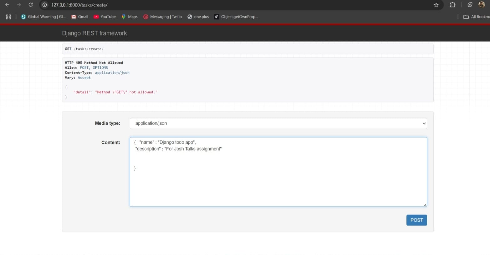
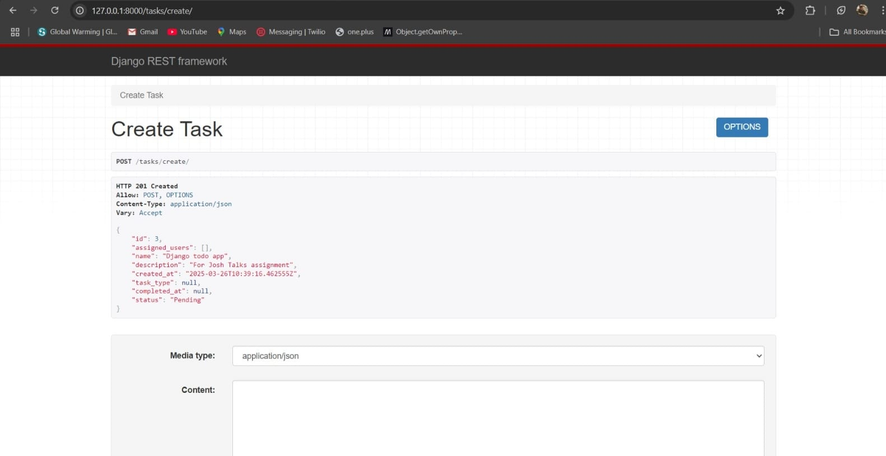
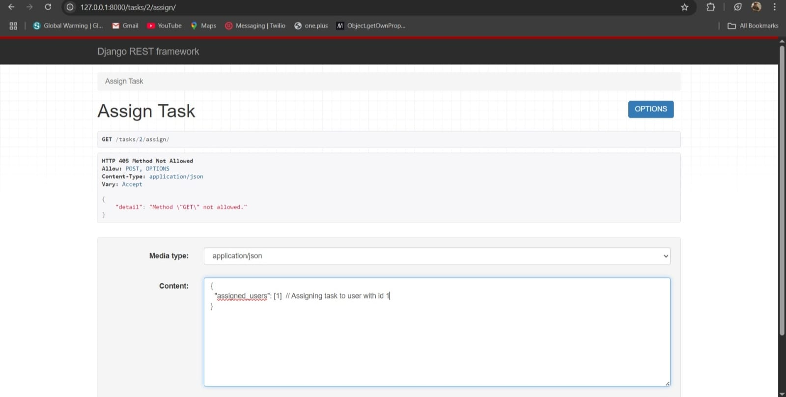
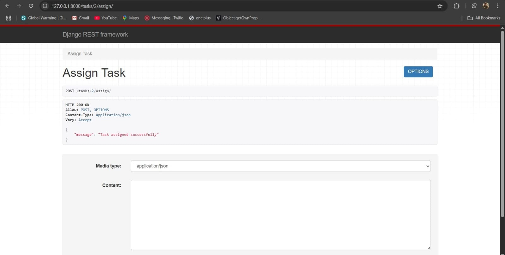
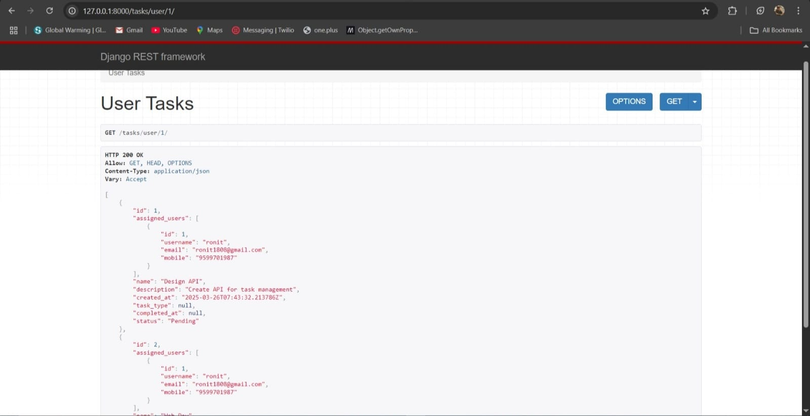

# Task Management API

## Overview
This is a **Task Management API** built using **Django** and **Django REST Framework (DRF)**. It allows users to create tasks, assign tasks to multiple users, and retrieve tasks assigned to a specific user.

## Features
- **Create tasks** with a name and description.
- **Assign tasks** to multiple users.
- **Retrieve all tasks** assigned to a specific user.

## Tech Stack
- **Backend:** Django, Django REST Framework
- **Database:** SQLite 
- **Authentication:** Django's built-in authentication system

---

## Installation & Setup
### 1️⃣ Clone the Repository
```sh
git clone https://github.com/Ronit1808/DjangoTodo.git
cd taskapp
```

### 2️⃣ Create a Virtual Environment
```sh
python -m venv venv
source venv/bin/activate  # On Windows: venv\Scripts\activate
```

### 3️⃣ Install Dependencies
```sh
pip install -r requirements.txt
```

### 4️⃣ Apply Migrations & Run Server
```sh
python manage.py migrate
python manage.py runserver
```

### 5️⃣ Create a Superuser (For adding new users)
```sh
python manage.py createsuperuser  
```
---

## API Endpoints
### **1️⃣ Create a Task**
**Endpoint:** `POST /tasks/create/`
#### **Request Body:**
```json
{
  "name": "Web Dev",
  "description": "Web Dev is cool"
}
```
#### **Response:**
```json
{
  "id": 1,
  "assigned_users": []
  "name": "Web Dev",
  "description": "Web Dev is cool",
  "created_at": "2025-03-26T10:32:44.866763Z",
  "task_type": null,
  "completed_at": null,
  "status": "Pending"
}
```
---

### **2️⃣ Assign a Task to Users**
**Endpoint:** `POST /tasks/{task_id}/assign/`
#### **Request Body:**
```json
{
  "assigned_users": [1]
}
```
#### **Response:**
```json
{
  "message": "Task assigned successfully"
}
```
---

### **3️⃣ Get Tasks Assigned to a User**
**Endpoint:** `GET /tasks/user/{user_id}/`
#### **Response:**
```json
[
  {
        "id": 2,
        "assigned_users": [
            {
                "id": 1,
                "username": "ronit",
                "email": "ronit1808@gmail.com",
                "mobile": "987654321"
            }
        ],
        "name": "Web Dev",
        "description": "web dev is cool",
        "created_at": "2025-03-26T10:32:44.866763Z",
        "task_type": null,
        "completed_at": null,
        "status": "Pending"
    }
    ]
```

---

## Testing the API with Postman
1. Open **Postman**.
2. Make a **POST** request to `http://127.0.0.1:8000/tasks/create/` to create a task.
3. Make a **POST** request to `http://127.0.0.1:8000/tasks/1/assign/` to assign users.
4. Make a **GET** request to `http://127.0.0.1:8000/tasks/user/1/` to fetch tasks for a user.


---

## Screnshots








--- 


## Contributing
Feel free to fork this repository and submit a pull request with any improvements!

---

## License
This project is open-source and available under the **MIT License**.

